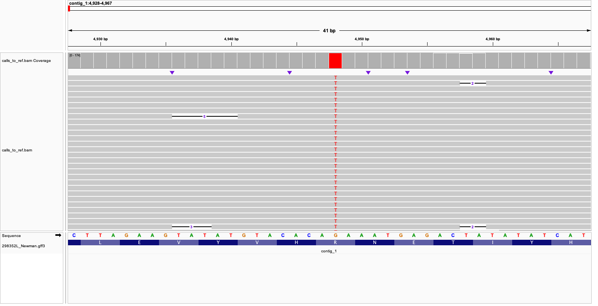

# contents

 - [connect to cluster](#connect-to-cluster)
 - [install `conda`](#install-conda)
 - [create a conda environment for `medaka` version 2.1.1](#create-a-conda-environment-for-medaka-version-211)
 - [create a conda environment for `snippy` version 4.6.0](#create-a-conda-environment-for-snippy-version-460)
 - [create a conda environment for `sniffles` version 2.6.3](#create-a-conda-environment-for-sniffles-version-263)
 - [create working directory](#create-working-directory)
 - [copy example data](#copy-example-data)
 - [create a job script](#create-a-job-script)
 - [submit the job script to the cluster](#submit-the-job-script-to-the-cluster)
 - [create `snpEff` database for reference genome](#create-snpeff-database-for-reference-genome)
 - [annotate variants with `snpEff`](#annotate-variants-with-snpeff)
 - [call structural variants with `sniffles`](#call-structural-variants-with-sniffles)
 - [download results to your local computer](#download-results-to-your-local-computer)

## connect to cluster

The cluster only accepts password logins from a limited whitelist of St Andrews IP addresses, which does not include wireless eduroam. You will need to follow the [instructions](https://help.cropdiversity.ac.uk/ssh-terminal-keys.html) to generate an `ssh` key pair that will allow you to connect from outside of the IP whitelist range. You will be randomly prompted for 2FA authenication. You will therefore need to follow the instructions in the welcome email to setup 2FA.

You can login to the cluster using `ssh` from a terminal. Your cluster username is given in the welcome email and will differ from you St Andrews SSO username.

```
# replace "CROP_DIVERSITY_USERNAME" with your actual cluster username
ssh CROP_DIVERSITY_USERNAME@gruffalo.cropdiversity.ac.uk
```

## install `conda`

You only need to do this step once (the very first time you use `conda` on the cluster).

`conda` is a package manager that simplifies the installation of software and its dependencies. There is a script `install-bioconda` that has been created by the  system administrator to ensure that `conda` is installed to the fast SSD storage array (rather than the default location).

Simply run the following command (type and press <kbd>Enter</kbd>):

```
install-bioconda
```

Your shell needs to be reloaded to recognize the `conda` command. You can do this by closing and reopening your terminal session. Either type `exit` and press <kbd>Enter</kbd> or use the shortcut <kbd>Ctrl</kbd> + <kbd>D</kbd>.

Now run:

```
conda init
```
## create a conda environment for `medaka` version 2.1.1

I strongly recommend that you create a separate conda environment for each software package you want to use. This allows you to manage different versions of software and their dependencies without conflicts.

To create a conda environment named `medaka_v2.1.1` (containing `medaka` version 2.1.1), use the following command:

```
conda create -n medaka_v2.1.1 medaka=2.1.1
```

You will be prompted to confirm the installation of the package and its dependencies. Type `y` and press <kbd>Enter</kbd> to proceed.

Later on we will use the conda environments in scripts by including a line such as:

```
conda activate medaka_v2.1.1
```

## create a conda environment for `snippy` version 4.6.0

We are not going to use `snippy` directly but we will use one of its dependencies `snpEff`, and also its internal script `snippy-vcf_to_tab` to summarise the annotated variants.

```
conda create -n snippy_v4.6.0 snippy=4.6.0
```

Type `y` and press <kbd>Enter</kbd> to proceed.

## create a conda environment for `sniffles` version 2.6.3

```
conda create -n sniffles_v2.6.3 sniffles=2.6.3
```

## create working directory

Doublecheck you are connected to the cluster by printing the hostname:

```
hostname
```

This should return:

```console
gruffalo.hpc.hutton.ac.uk
```

Check where you are by printing the current directory:

```
pwd
```

This should return your home directory (/home/USERNAME):

```console
/home/pjohnsto
```

Your home directory is where you end up each time you log in to the cluster but your work should be done under your scratch directory to prevent large files from slowing down the nightly backuups of home. Scratch is located under `/mnt/shared/scratch/USERNAME`.

Go to your scratch directory:

```
# replace "USERNAME" with your actual cluster username
cd /mnt/shared/scratch/USERNAME
```

List the contents of your scratch directory:

```
ls -l
```

It might be empty if you haven't done any work on the cluster yet:

```console
total 0
```

Create a new directory for your work called `medaka_test`:

```
mkdir medaka_test
```

Go into the new directory:

```
cd medaka_test
```

List the contents of the directory to confirm you are in the right place:

```
ls -l
```
This should return:

```console
total 0
```

Lets also make directories to hold our input data and results:

```
mkdir data results
```

## copy example data 

Important data can be stored under `/mnt/shared/projects/`, which is backed regularly. Your RNAseq and genome sequencing data are stored under `/mnt/shared/projects/uosa/jo_hobbs/`. List the contents to show what is there:

```
ls -l /mnt/shared/projects/uosa/jo_hobbs/
```

This should return:

```console
total 4
drwxr-xr-x 3 pjohnsto pjohnsto  1 Sep 10 23:41 27fe1d4a91_20250116_Hobbs1L
drwxr-xr-x 3 pjohnsto pjohnsto  1 Sep 10 23:43 8c945c2160_20250402_Hobbs1L
drwxr-xr-x 3 pjohnsto pjohnsto  1 Sep 10 23:32 90e0c7d374_20250307_Hobbs1L
drwxr-xr-x 3 pjohnsto pjohnsto  1 Sep 10 23:50 a3e9ca7c3a_20250513_Deventer1L
drwxr-xr-x 3 pjohnsto pjohnsto  1 Sep 10 23:43 a4e1039713_20250122_Hobbs1L
drwxr-xr-x 2 pjohnsto pjohnsto 52 Sep 10 23:30 rnaseq_01
drwxr-xr-x 2 pjohnsto pjohnsto 19 Apr  1 23:55 rnaseq_02
```

In the future when you have more microbesng data available, you can download like so:

(this is just an example, do not run these commands as the data is already present)

```
# go to the projects directory
cd /mnt/shared/projects/uosa/jo_hobbs/
# right click on "Download Reads" on microbesng and copy the link address
wget -O "a3e9ca7c3a_20250513_Deventer1L.zip" "https://microbesng-data.s3-eu-west-1.amazonaws.com/projects/a3e9ca7c3a_20250513_Deventer1L/reads.zip"
# unzip the data
unzip a3e9ca7c3a_20250513_Deventer1L.zip
```

For today, lets copy some example data into our working directory. This is a fastq file containing nanopore reads for one of the samples (303544L_NewmanNOVR) and a reference genome (298352L_Newman).

```
# copy the reads for 303544L_NewmanNOVR to our data directory
cp /mnt/shared/projects/uosa/jo_hobbs/90e0c7d374_20250307_Hobbs1L/long_reads/303544L_NewmanNOVR.fastq.gz data/ 
# copy the reference genome for 298352L_Newman to our data directory
cp -r /mnt/shared/projects/uosa/jo_hobbs/298352L_Newman data/
```

## create a job script

Create a new file called `medaka_test.sh`:

```
touch medaka_test.sh
```

Open `medaka_test.sh` using the `nano` text editor:

```
nano medaka_test.sh
```

This will open the `nano` text editor. Copy and paste the following lines into the editor:

```bash
#!/bin/bash
#SBATCH --chdir=/mnt/shared/scratch/USERNAME/medaka_test/
#SBATCH --job-name=med_test
#SBATCH --partition=short
#SBATCH --ntasks=8
#SBATCH --mem=16G
#SBATCH --cpus-per-task=1

# load your settings file to set up conda
source /home/${USER}/.bashrc

# activate the conda environment containing medaka
conda activate medaka_v2.1.1
source /mnt/apps/users/USERNAME/conda/bin/activate medaka_v2.1.1
# run medaka to call variants
medaka_variant \
  -i data/303544L_NewmanNOVR.fastq.gz \
  -r data/298352L_Newman/298352L_Newman.fna \
  -o results/303544L_NewmanNOVR \
  -t $SLURM_CPUS_PER_TASK \
  -f -x

# filter variants to 99% confidence and minimum depth of 10
bcftools view -i 'QUAL>30 & DP>10' \
  results/303544L_NewmanNOVR/medaka.annotated.vcf \
  > results/303544L_NewmanNOVR/medaka.annotated.filt.vcf

```

Use your arrow keys to navigate to line 2 and replace `USERNAME` with your actual cluster username. Save the changes by pressing <kbd>Ctrl</kbd> + <kbd>X</kbd>, then type `y` and press <kbd>Enter</kbd> to exit.

As a final check, print the contents of the script to the terminal:

```
cat medaka_test.sh
```

This should return:

```console
#!/bin/bash
#SBATCH --chdir=/mnt/shared/scratch/pjohnsto/medaka_test/
#SBATCH --job-name=med_test
#SBATCH --partition=short
#SBATCH --ntasks=8
#SBATCH --mem=16G
#SBATCH --cpus-per-task=1

# load your settings file to set up conda
source /home/${USER}/.bashrc

# activate the conda environment containing medaka
conda activate medaka_v2.1.1

# run medaka to call variants
medaka_variant \
  -i data/303544L_NewmanNOVR.fastq.gz \
  -r data/298352L_Newman/298352L_Newman.fna \
  -o results/303544L_NewmanNOVR \
  -t $SLURM_CPUS_PER_TASK \
  -f -x

# filter variants to 99% confidence and minimum depth of 10
bcftools view -i 'QUAL>30 & DP>10' \
  results/303544L_NewmanNOVR/medaka.annotated.vcf \
  > results/303544L_NewmanNOVR/medaka.annotated.filt.vcf
```

## submit the job script to the cluster

Use the `sbatch` command to submit the script for execution:

```
sbatch medaka_test.sh
```

You can check on your jobs progress in the queue:

```
squeue --me
```

```console
             JOBID PARTITION     NAME     USER ST       TIME  NODES NODELIST(REASON)
           3440110     short med_test pjohnsto  R       0:19      1 n24-64-384-buffy
```

When you run programs, output and error messages will often be displayed in the terminal window. However, when you submit a job to the cluster using `sbatch`, these two output streams are redirected to a file. By default, these files are named `slurm-<job_id>.out` and are created in the directory from which you submitted the job.

You can check the contents of this file to see the output and any error messages generated by your job. Use the `cat` command followed by the filename to display its contents. Using the job ID from the above example:

```
cat slurm-3440110.out
```

```console
[17:08:40 - MdlStrTGZ] Successfully removed temporary files from /tmp/pjohnsto_3440110/tmpziqg3jcs.
Attempting to automatically select model version.
SUCCESS: Automatic model selection chose model: '/mnt/apps/users/pjohnsto/conda/envs/medaka_v2.1.1/lib/python3.12/site-packages/medaka/data/r1041_e82_400bps_sup_variant_v4.3.0_model_pt.tar.gz'
Checking program versions
This is medaka 2.1.1
Program    Version    Required   Pass     
bcftools   1.22       1.11       True     
bgzip      1.22.1     1.11       True     
minimap2   2.30       2.11       True     
samtools   1.22.1     1.11       True     
tabix      1.22.1     1.11       True     
[17:08:43 - MdlStrTGZ] Successfully removed temporary files from /tmp/pjohnsto_3440110/tmpjd1fs0mv.
[17:08:43 - MdlStrTGZ] Successfully removed temporary files from /tmp/pjohnsto_3440110/tmph_wu4br8.
Aligning basecalls to reference
Removing previous fai index file /mnt/shared/scratch/pjohnsto/medaka_test/data/298352L_Newman/298352L_Newman.fna.fai
Creating fai index file /mnt/shared/scratch/pjohnsto/medaka_test/data/298352L_Newman/298352L_Newman.fna.fai
Removing previous mmi index file /mnt/shared/scratch/pjohnsto/medaka_test/data/298352L_Newman/298352L_Newman.fna.map-ont.mmi
Creating mmi index file /mnt/shared/scratch/pjohnsto/medaka_test/data/298352L_Newman/298352L_Newman.fna.map-ont.mmi
[M::mm_idx_gen::0.078*0.85] collected minimizers
[M::mm_idx_gen::0.098*1.23] sorted minimizers
[M::main::0.193*0.78] loaded/built the index for 4 target sequence(s)
[M::mm_idx_stat] kmer size: 15; skip: 10; is_hpc: 0; #seq: 4
[M::mm_idx_stat::0.205*0.79] distinct minimizers: 509871 (95.52% are singletons); average occurrences: 1.070; average spacing: 5.348; total length: 2918651
[M::main] Version: 2.30-r1287
[M::main] CMD: minimap2 -I 16G -x map-ont -d /mnt/shared/scratch/pjohnsto/medaka_test/data/298352L_Newman/298352L_Newman.fna.map-ont.mmi /mnt/shared/scratch/pjohnsto/medaka_test/data/298352L_Newman/298352L_Newman.fna
[M::main] Real time: 0.215 sec; CPU: 0.166 sec; Peak RSS: 0.032 GB
[M::main::0.103*0.59] loaded/built the index for 4 target sequence(s)
[M::mm_mapopt_update::0.117*0.63] mid_occ = 10
[M::mm_idx_stat] kmer size: 15; skip: 10; is_hpc: 0; #seq: 4
[M::mm_idx_stat::0.128*0.65] distinct minimizers: 509871 (95.52% are singletons); average occurrences: 1.070; average spacing: 5.348; total length: 2918651
[M::worker_pipeline::123.185*0.93] mapped 59595 sequences
[M::worker_pipeline::145.449*0.89] mapped 7734 sequences
[M::main] Version: 2.30-r1287
[M::main] CMD: minimap2 -x map-ont --secondary=no -L --MD -A 2 -B 4 -O 4,24 -E 2,1 -t 1 -a /mnt/shared/scratch/pjohnsto/medaka_test/data/298352L_Newman/298352L_Newman.fna.map-ont.mmi /mnt/shared/scratch/pjohnsto/medaka_test/data/303544L_NewmanNOVR.fastq.gz
[M::main] Real time: 145.476 sec; CPU: 130.172 sec; Peak RSS: 1.165 GB
[bam_sort_core] merging from 1 files and 1 in-memory blocks...
Running medaka inference
[17:11:30 - Predict] Processing region(s): contig_1:0-2884053 contig_2:0-2448 contig_3:0-15908 contig_4:0-16242
[17:11:30 - Predict] Using model: /mnt/apps/users/pjohnsto/conda/envs/medaka_v2.1.1/lib/python3.12/site-packages/medaka/data/r1041_e82_400bps_sup_variant_v4.3.0_model_pt.tar.gz.
[17:11:30 - Predict] Using minimum mapQ threshold of 1 for read filtering.
[17:11:30 - MdlStrTGZ] Model GRUModel(
  (gru): GRU(10, 128, num_layers=2, batch_first=True, bidirectional=True)
  (linear): Linear(in_features=256, out_features=5, bias=True)
)
[17:11:30 - MdlStrTGZ] loading weights from /tmp/pjohnsto_3440110/tmplk90vfc_/model/weights.pt
[17:11:30 - MdlStrTGZ] Successfully removed temporary files from /tmp/pjohnsto_3440110/tmplk90vfc_.
[17:11:30 - Predict] Model device: cpu
[17:11:30 - Predict] Running prediction at full precision
[17:11:30 - Predict] Processing 5 long region(s) with batching.
[17:11:30 - PWorker] Running inference for 2.9M draft bases.
[17:11:35 - Feature] Pileup counts do not span requested region, requested contig_3:0-15908, received 15017-15905.
[17:11:35 - Feature] Pileup counts do not span requested region, requested contig_4:0-16242, received 0-7501.
[17:12:20 - PWorker] Processed 5 batches
[17:12:20 - PWorker] All done, 2 remainder regions.
[17:12:20 - Predict] Processing 3 short region(s).
[17:12:20 - PWorker] Running inference for 0.0M draft bases.
[17:12:23 - PWorker] Processed 3 batches
[17:12:23 - PWorker] All done, 0 remainder regions.
[17:12:23 - Predict] Finished processing all regions.
[17:12:25 - DataIndx] Loaded 1/1 (100.00%) sample files.
[17:12:25 - Variants] Processing contig_1:0-.
[17:12:34 - Variants] Processing contig_2:0-.
[17:12:34 - Variants] Processing contig_3:0-.
[17:12:34 - Variants] Processing contig_4:0-.
Writing to /tmp/pjohnsto_3440110/bcftools.h6rsYA
Merging 1 temporary files
Done
Cleaning
[17:12:36 - Annotate] Getting chrom coordinates
[17:12:36 - Annotate] Processing chunk with coordinates: contig_1:4947-504947
[17:12:36 - Annotate] Processing chunk with coordinates: contig_1:262527-762527
[17:12:36 - Annotate] Processing chunk with coordinates: contig_3:15051-15899
[17:12:36 - Annotate] Processing chunk with coordinates: contig_4:434-7087
Variants written to results/303544L_NewmanNOVR/medaka.annotated.vcf, have a nice day.
```

Lets list the contents of the results directory to see what has been generated:

```
ls -l results/303544L_NewmanNOVR
```

This should return:

```console
total 571393
-rw-r--r-- 1 pjohnsto pjohnsto 482550664 Sep 11 17:11 calls_to_ref.bam
-rw-r--r-- 1 pjohnsto pjohnsto    188080 Sep 11 17:11 calls_to_ref.bam.bai
-rw-r--r-- 1 pjohnsto pjohnsto 102460442 Sep 11 17:12 consensus_probs.hdf
-rw-r--r-- 1 pjohnsto pjohnsto      3331 Sep 11 17:12 medaka.annotated.filt.vcf
-rw-r--r-- 1 pjohnsto pjohnsto     18915 Sep 11 17:12 medaka.annotated.vcf
-rw-r--r-- 1 pjohnsto pjohnsto     14180 Sep 11 17:12 medaka.sorted.vcf
-rw-r--r-- 1 pjohnsto pjohnsto     14128 Sep 11 17:12 medaka.vcf
```

The quality/depth filtered variants are in `medaka.annotated.filt.vcf`.

Look at the filtered variants:

```
cat results/303544L_NewmanNOVR/medaka.annotated.filt.vcf
```
This should return:

```console
##fileformat=VCFv4.1
##FILTER=<ID=PASS,Description="All filters passed">
##medaka_version=2.1.1
##contig=<ID=contig_1>
##contig=<ID=contig_3>
##contig=<ID=contig_4>
##contig=<ID=contig_2,length=2448>
##FORMAT=<ID=GT,Number=1,Type=String,Description="Medaka genotype.">
##FORMAT=<ID=GQ,Number=1,Type=Integer,Description="Medaka genotype quality score">
##INFO=<ID=DP,Number=1,Type=Integer,Description="Depth of reads at position, calculated from read pileup, capped to ~8000.">
##INFO=<ID=DPS,Number=2,Type=Integer,Description="Depth of reads at position by strand (fwd, rev), calculated from read pileup, capped to ~8000 total.">
##INFO=<ID=DPSP,Number=1,Type=Integer,Description="Depth of reads spanning pos +-25. This is not capped as in the case of DP and DPS.">
##INFO=<ID=SR,Number=.,Type=Integer,Description="Depth of spanning reads by strand which best align to each allele (ref fwd, ref rev, alt1 fwd, alt1 rev, etc.). This is not capped as in the case of DP and DPS.">
##INFO=<ID=AR,Number=2,Type=Integer,Description="Depth of ambiguous spanning reads by strand which align equally well to all alleles (fwd, rev). This is not capped as in the case of DP and DPS.">
##INFO=<ID=SC,Number=.,Type=Integer,Description="Total alignment score to each allele of spanning reads by strand (ref fwd, ref rev, alt1 fwd, alt1 rev, etc.) aligned with parasail: match 5, mismatch -4, open 5, extend 3">
##bcftools_viewVersion=1.22+htslib-1.22.1
##bcftools_viewCommand=view -i 'QUAL>30 & DP>10' results/303544L_NewmanNOVR/medaka.annotated.vcf; Date=Thu Sep 11 17:26:29 2025
#CHROM	POS	ID	REF	ALT	QUAL	FILTER	INFO	FORMAT	SAMPLE
contig_1	4948	.	G	T	49.325	PASS	AR=1,0;DP=173;DPS=92,81;DPSP=170;SC=21909,19081,22719,19792;SR=0,0,90,79	GT:GQ	1:49
contig_1	761225	.	CTTTGCATTTTATTTTATAAATAAATCGGATTATGACGTAATGTCTAATTTGTGTAATGTTACAGTCA	C	278.046	PASS	AR=83,88;DP=181;DPS=86,95;DPSP=176;SC=10347,11684,10342,11659;SR=1,4,0,0	GT:GQ	1:278
contig_1	761336	.	GTTATTTTGTTG	CCCCCCCCCCCC	30.543	PASS	AR=0,0;DP=176;DPS=84,92;DPSP=0;SC=0,0,0,0;SR=0,0,0,0	GT:GQ	1:31
contig_1	761391	.	GTTTTTGTATTA	CCCCCCCCCCCC	38.646	PASS	AR=0,0;DP=176;DPS=84,92;DPSP=0;SC=0,0,0,0;SR=0,0,0,0	GT:GQ	1:39
contig_1	761453	.	TGGTATAATG	CCCCCCCCCC	31.74	PASS	AR=0,0;DP=176;DPS=84,92;DPSP=0;SC=0,0,0,0;SR=0,0,0,0	GT:GQ	1:32
contig_1	761518	.	TAATATTAATAT	CCCCCCCCCCCC	32.663	PASS	AR=0,0;DP=176;DPS=84,92;DPSP=0;SC=0,0,0,0;SR=0,0,0,0	GT:GQ	1:33
contig_1	761546	.	ATTTGAAAATTTTAG	CCCCCCCCCCCCCCC	40.409	PASS	AR=0,0;DP=176;DPS=84,92;DPSP=0;SC=0,0,0,0;SR=0,0,0,0	GT:GQ	1:40
contig_1	761570	.	AAGTAAGTTTGTTAAAATA	CCCCCCCCCCCCCCCCCCC	47.875	PASS	AR=0,0;DP=176;DPS=84,92;DPSP=0;SC=0,0,0,0;SR=0,0,0,0	GT:GQ	1:48
contig_1	761605	.	GATATTGATAAAATG	CCCCCCCCCCCCCCC	36.1	PASS	AR=0,0;DP=176;DPS=84,92;DPSP=0;SC=0,0,0,0;SR=0,0,0,0	GT:GQ	1:36
contig_1	761714	.	TAGTTGTATTAATT	CCCCCCCCCCCCCC	31.917	PASS	AR=0,0;DP=176;DPS=84,92;DPSP=0;SC=0,0,0,0;SR=0,0,0,0	GT:GQ	1:32
contig_1	761729	.	TGGGGGATATGTTTTA	CCCCCCCCCCCCCCCC	38.326	PASS	AR=0,0;DP=176;DPS=84,92;DPSP=0;SC=0,0,0,0;SR=0,0,0,0	GT:GQ	1:38
contig_1	761747	.	TGTATTTAAAGTGATAATATGAGT	CCCCCCCCCCCCCCCCCCCCCCCC	50.503	PASS	AR=0,0;DP=176;DPS=84,92;DPSP=0;SC=0,0,0,0;SR=0,0,0,0	GT:GQ	1:51
contig_1	761780	.	AAATAATGTTGATAAT	CCCCCCCCCCCCCCCC	30.043	PASS	AR=0,0;DP=176;DPS=84,92;DPSP=0;SC=0,0,0,0;SR=0,0,0,0	GT:GQ	1:30
contig_1	761804	.	TTGTTTAATTAATATGT	CCCCCCCCCCCCCCCCC	35.04	PASS	AR=0,0;DP=176;DPS=84,92;DPSP=0;SC=0,0,0,0;SR=0,0,0,0	GT:GQ	1:35
contig_1	761897	.	TAAAGGTGTTTTTAAAT	CCCCCCCCCCCCCCCCC	30.492	PASS	AR=0,0;DP=176;DPS=84,92;DPSP=0;SC=0,0,0,0;SR=0,0,0,0	GT:GQ	1:30
contig_1	761997	.	ATTTTATTAAAAGATTGATTTAATT	CCCCCCCCCCCCCCCCCCCCCCCCC	36.142	PASS	AR=0,0;DP=176;DPS=84,92;DPSP=0;SC=0,0,0,0;SR=0,0,0,0	GT:GQ	1:36
contig_1	762108	.	TTAATTTTTTGTATAAGTGGATTAATAAAAATA	CCCCCCCCCCCCCCCCCCCCCCCCCCCCCCCCC	37.538	PASS	AR=0,0;DP=176;DPS=84,92;DPSP=0;SC=0,0,0,0;SR=0,0,0,0	GT:GQ	1:38
contig_1	762349	.	AGTTGTGATGGTATATGTTGTAAAG	CCCCCCCCCCCCCCCCCCCCCCCCC	33.615	PASS	AR=0,0;DP=176;DPS=84,92;DPSP=0;SC=0,0,0,0;SR=0,0,0,0	GT:GQ	1:34
```

## create `snpEff` database for reference genome

Create an empty file called `build_snpEffdb.sh`:

```
touch build_snpEffdb.sh
```

Open the file in the `nano` text editor:

```
nano build_snpEffdb.sh
```

Copy and paste the following lines into the editor, and replace `USERNAME` on line 2 with your username:

```bash
#!/bin/bash
#SBATCH --chdir=/mnt/shared/scratch/USERNAME/medaka_test/
#SBATCH --job-name=snpEff
#SBATCH --partition=short
#SBATCH --ntasks=1
#SBATCH --mem=4G
#SBATCH --cpus-per-task=1

# load your settings file to set up conda
source /home/${USER}/.bashrc

# activate the conda environment containing snippy
conda activate snippy_v4.6.0
source /mnt/apps/users/USERNAME/conda/bin/activate snippy_v4.6.0

# Create the snpEff directory structure
mkdir -p snpEff/data/298352L_Newman

# Copy genome file with the expected name
cp data/298352L_Newman/298352L_Newman.fna snpEff/data/298352L_Newman/sequences.fa
# Copy annotation file with the expected name  
cp data/298352L_Newman/298352L_Newman.gff3 snpEff/data/298352L_Newman/genes.gff

# Create a snpEff config file
cat > snpEff/snpEff.config << 'EOF'

# snpEff configuration file
data.dir = ./data/

# Database repository (local only)
database.repository = ""
database.local.repository = true

# Genome definition
298352L_Newman.genome : 298352L_Newman
298352L_Newman.chromosomes : 
298352L_Newman.reference : 
EOF
        
# Build the database
cd snpEff && snpEff build -gff3 -v 298352L_Newman

```

Save the changes by pressing <kbd>Ctrl</kbd> + <kbd>X</kbd>, then type `y` and press <kbd>Enter</kbd> to exit.

Submit the script for execution:

```
sbatch build_snpEffdb.sh
```

The job should complete very quickly (possibly quicker than you can run `squeue --me`).

Check the output file to confirm the database was built successfully:

```
cat slurm-3440136.out
```

## annotate variants with `snpEff`

Create an empty file called `run_snpEff.sh`:

```
touch run_snpEff.sh
```

Open the file in the `nano` text editor:

```
nano run_snpEff.sh
```

Copy and paste the following lines into the editor, and replace `USERNAME` on line 2 with your username:

```bash
#!/bin/bash
#SBATCH --chdir=/mnt/shared/scratch/USERNAME/medaka_test/
#SBATCH --job-name=snpEff
#SBATCH --partition=short
#SBATCH --ntasks=1
#SBATCH --mem=4G
#SBATCH --cpus-per-task=1

# load your settings file to set up conda
source /home/${USER}/.bashrc

# activate the conda environment containing snippy
conda activate snippy_v4.6.0
source /mnt/apps/users/USERNAME/conda/bin/activate snippy_v4.6.0

# run snpEff
cd snpEff && snpEff ann -v \
    -config snpEff.config \
    -s ../results/303544L_NewmanNOVR/snpEff_summary.html \
    298352L_Newman \
    ../results/303544L_NewmanNOVR/medaka.annotated.filt.vcf > ../results/303544L_NewmanNOVR/snpEff.vcf

# summarise in .tsv
snippy-vcf_to_tab --ref data/298352L_Newman/sequences.fa --gff data/298352L_Newman/genes.gff --vcf ../results/303544L_NewmanNOVR/snpEff.vcf > ../results/303544L_NewmanNOVR/snp.tab

```

Save the changes by pressing <kbd>Ctrl</kbd> + <kbd>X</kbd>, then type `y` and press <kbd>Enter</kbd> to exit.

Submit the script for execution:

```
sbatch run_snpEff.sh
```

This job will also complete very quickly. List the contents of the results directory to see what has been generated:

```
ls -lrth results/303544L_NewmanNOVR/
```

This should return:

```console
total 559M
-rw-r--r-- 1 pjohnsto pjohnsto 461M Sep 11 17:11 calls_to_ref.bam
-rw-r--r-- 1 pjohnsto pjohnsto 184K Sep 11 17:11 calls_to_ref.bam.bai
-rw-r--r-- 1 pjohnsto pjohnsto  98M Sep 11 17:12 consensus_probs.hdf
-rw-r--r-- 1 pjohnsto pjohnsto  14K Sep 11 17:12 medaka.vcf
-rw-r--r-- 1 pjohnsto pjohnsto  14K Sep 11 17:12 medaka.sorted.vcf
-rw-r--r-- 1 pjohnsto pjohnsto  19K Sep 11 17:12 medaka.annotated.vcf
-rw-r--r-- 1 pjohnsto pjohnsto 3.3K Sep 11 17:12 medaka.annotated.filt.vcf
-rw-r--r-- 1 pjohnsto pjohnsto 163K Sep 11 17:18 snpEff_summary.html
-rw-r--r-- 1 pjohnsto pjohnsto 2.4K Sep 11 17:18 snpEff_summary.genes.txt
-rw-r--r-- 1 pjohnsto pjohnsto  50K Sep 11 17:18 snpEff.vcf
-rw-r--r-- 1 pjohnsto pjohnsto 5.2K Sep 11 17:18 snp.tab

```

Have a look a the summary table:

```
cat results/303544L_NewmanNOVR/snp.tab
```

This should return:

```console
CHROM	POS	TYPE	REF	ALT	EVIDENCE	FTYPE	STRAND	NT_POS	AA_POS	EFFECT	LOCUS_TAG	GENE	PRODUCT
contig_1	4948		G	T	T:0 G:0	CDS	+	431/1935	144/644	missense_variant c.431G>T p.Arg144Ile	EBLKDO_00005	gyrB	DNA topoisomerase (ATP-hydrolyzing) subunit B
contig_1	761225		CTTTGCATTTTATTTTATAAATAAATCGGATTATGACGTAATGTCTAATTTGTGTAATGTTACAGTCA	C	C:0 CTTTGCATTTTATTTTATAAATAAATCGGATTATGACGTAATGTCTAATTTGTGTAATGTTACAGTCA:0	region	+		340/351	frameshift_variant&stop_lost&splice_region_variant c.1019_*29delTGACTGTAACATTACACAAATTAGACATTACGTCATAATCCGATTTATTTATAAAATAAAATGCAAA p.Met340fs			
contig_1	761336		GTTATTTTGTTG	CCCCCCCCCCCC	CCCCCCCCCCCC:0 GTTATTTTGTTG:0	CDS	-	975/1056	322/351	missense_variant c.964_975delCAACAAAATAACinsGGGGGGGGGGGG p.GlnGlnAsnAsn322GlyGlyGlyGly	EBLKDO_00743	saeS	two-component system sensor histidine kinase SaeS
contig_1	761391		GTTTTTGTATTA	CCCCCCCCCCCC	CCCCCCCCCCCC:0 GTTTTTGTATTA:0	CDS	-	920/1056	303/351	missense_variant c.909_920delTAATACAAAAACinsGGGGGGGGGGGG p.AsnThrLysThr304GlyGlyGlyGly	EBLKDO_00743	saeS	two-component system sensor histidine kinase SaeS
contig_1	761453		TGGTATAATG	CCCCCCCCCC	CCCCCCCCCC:0 TGGTATAATG:0	CDS	-	858/1056	283/351	missense_variant c.849_858delCATTATACCAinsGGGGGGGGGG p.IleIlePro284GlyGlyGly	EBLKDO_00743	saeS	two-component system sensor histidine kinase SaeS
contig_1	761518		TAATATTAATAT	CCCCCCCCCCCC	CCCCCCCCCCCC:0 TAATATTAATAT:0	CDS	-	793/1056	261/351	missense_variant c.782_793delATATTAATATTAinsGGGGGGGGGGGG p.AspIleAsnIleSer261GlyGlyGlyGlyGly	EBLKDO_00743	saeS	two-component system sensor histidine kinase SaeS
contig_1	761546		ATTTGAAAATTTTAG	CCCCCCCCCCCCCCC	CCCCCCCCCCCCCCC:0 ATTTGAAAATTTTAG:0	CDS	-	765/1056	251/351	missense_variant c.751_765delCTAAAATTTTCAAATinsGGGGGGGGGGGGGGG p.LeuLysPheSerAsn251GlyGlyGlyGlyGly	EBLKDO_00743	saeS	two-component system sensor histidine kinase SaeS
contig_1	761570		AAGTAAGTTTGTTAAAATA	CCCCCCCCCCCCCCCCCCC	CCCCCCCCCCCCCCCCCCC:0 AAGTAAGTTTGTTAAAATA:0	CDS	-	741/1056	241/351	missense_variant c.723_741delTATTTTAACAAACTTACTTinsGGGGGGGGGGGGGGGGGGG p.IleLeuThrAsnLeuLeu242GlyGlyGlyGlyGlyGly	EBLKDO_00743	saeS	two-component system sensor histidine kinase SaeS
contig_1	761605		GATATTGATAAAATG	CCCCCCCCCCCCCCC	CCCCCCCCCCCCCCC:0 GATATTGATAAAATG:0	CDS	-	706/1056	231/351	missense_variant c.692_706delCATTTTATCAATATCinsGGGGGGGGGGGGGGG p.AlaPheTyrGlnTyrArg231GlyGlyGlyGlyGlyGly	EBLKDO_00743	saeS	two-component system sensor histidine kinase SaeS
contig_1	761714		TAGTTGTATTAATT	CCCCCCCCCCCCCC	CCCCCCCCCCCCCC:0 TAGTTGTATTAATT:0	CDS	-	597/1056	195/351	missense_variant c.584_597delAATTAATACAACTAinsGGGGGGGGGGGGGG p.GluLeuIleGlnLeu195GlyGlyGlyGlyGly	EBLKDO_00743	saeS	two-component system sensor histidine kinase SaeS
contig_1	761729		TGGGGGATATGTTTTA	CCCCCCCCCCCCCCCC	CCCCCCCCCCCCCCCC:0 TGGGGGATATGTTTTA:0	CDS	-	582/1056	189/351	missense_variant c.567_582delTAAAACATATCCCCCAinsGGGGGGGGGGGGGGGG p.LysThrTyrProPro190GlyGlyGlyGlyGly	EBLKDO_00743	saeS	two-component system sensor histidine kinase SaeS
contig_1	761747		TGTATTTAAAGTGATAATATGAGT	CCCCCCCCCCCCCCCCCCCCCCCC	CCCCCCCCCCCCCCCCCCCCCCCC:0 TGTATTTAAAGTGATAATATGAGT:0	CDS	-	564/1056	181/351	missense_variant c.541_564delACTCATATTATCACTTTAAATACAinsGGGGGGGGGGGGGGGGGGGGGGGG p.ThrHisIleIleThrLeuAsnThr181GlyGlyGlyGlyGlyGlyGlyGly	EBLKDO_00743	saeS	two-component system sensor histidine kinase SaeS
contig_1	761780		AAATAATGTTGATAAT	CCCCCCCCCCCCCCCC	CCCCCCCCCCCCCCCC:0 AAATAATGTTGATAAT:0	CDS	-	531/1056	172/351	missense_variant c.516_531delATTATCAACATTATTTinsGGGGGGGGGGGGGGGG p.LeuSerThrLeuPhe173GlyGlyGlyGlyGly	EBLKDO_00743	saeS	two-component system sensor histidine kinase SaeS
contig_1	761804		TTGTTTAATTAATATGT	CCCCCCCCCCCCCCCCC	CCCCCCCCCCCCCCCCC:0 TTGTTTAATTAATATGT:0	CDS	-	507/1056	164/351	missense_variant c.491_507delACATATTAATTAAACAAinsGGGGGGGGGGGGGGGGG p.AspIleLeuIleLysGln164GlyGlyGlyGlyGlyGly	EBLKDO_00743	saeS	two-component system sensor histidine kinase SaeS
contig_1	761897		TAAAGGTGTTTTTAAAT	CCCCCCCCCCCCCCCCC	CCCCCCCCCCCCCCCCC:0 TAAAGGTGTTTTTAAAT:0	CDS	-	414/1056	133/351	missense_variant c.398_414delATTTAAAAACACCTTTAinsGGGGGGGGGGGGGGGGG p.AspLeuLysThrProLeu133GlyGlyGlyGlyGlyGly	EBLKDO_00743	saeS	two-component system sensor histidine kinase SaeS
contig_1	761997		ATTTTATTAAAAGATTGATTTAATT	CCCCCCCCCCCCCCCCCCCCCCCCC	CCCCCCCCCCCCCCCCCCCCCCCCC:0 ATTTTATTAAAAGATTGATTTAATT:0	CDS	-	314/1056	97/351	missense_variant c.290_314delAATTAAATCAATCTTTTAATAAAATinsGGGGGGGGGGGGGGGGGGGGGGGGG p.GluLeuAsnGlnSerPheAsnLysMet97GlyGlyGlyGlyGlyGlyGlyGlyGly	EBLKDO_00743	saeS	two-component system sensor histidine kinase SaeS
contig_1	762108		TTAATTTTTTGTATAAGTGGATTAATAAAAATA	CCCCCCCCCCCCCCCCCCCCCCCCCCCCCCCCC	CCCCCCCCCCCCCCCCCCCCCCCCCCCCCCCCC:0 TTAATTTTTTGTATAAGTGGATTAATAAAAATA:0	CDS	-	203/1056	57/351	missense_variant c.171_203delTATTTTTATTAATCCACTTATACAAAAAATTAAinsGGGGGGGGGGGGGGGGGGGGGGGGGGGGGGGGG p.SerIlePheIleAsnProLeuIleGlnLysIleLys57ArgGlyGlyGlyGlyGlyGlyGlyGlyGlyGlyGly	EBLKDO_00743	saeS	two-component system sensor histidine kinase SaeS
contig_1	762349		AGTTGTGATGGTATATGTTGTAAAG	CCCCCCCCCCCCCCCCCCCCCCCCC	CCCCCCCCCCCCCCCCCCCCCCCCC:0 AGTTGTGATGGTATATGTTGTAAAG:0	CDS	-	648/687	208/228	missense_variant c.624_648delCTTTACAACATATACCATCACAACTinsGGGGGGGGGGGGGGGGGGGGGGGGG p.SerPheThrThrTyrThrIleThrThr208ArgGlyGlyGlyGlyGlyGlyGlyGly	EBLKDO_00744	saeR	response regulator transcription factor SaeR
```

## call structural variants with `Sniffles`

Create an empty file called `sniffles.sh`:

```
touch sniffles.sh
```

Open the file in the `nano` text editor:

```
nano sniffles.sh
```

Copy and paste the following lines into the editor, and replace `USERNAME` on line 2 with your username:

```bash
#!/bin/bash
#SBATCH --chdir=/mnt/shared/scratch/USERNAME/medaka_test/
#SBATCH --job-name=sniffles
#SBATCH --partition=short
#SBATCH --ntasks=1
#SBATCH --mem=8G
#SBATCH --cpus-per-task=1

source /home/${USER}/.bashrc

conda activate sniffles_v2.6.3
source /mnt/apps/users/USERNAME/conda/bin/activate sniffles_v2.6.3

sniffles -i results/303544L_NewmanNOVR/calls_to_ref.bam -v results/303544L_NewmanNOVR/sniffles.vcf
```

Save the changes by pressing <kbd>Ctrl</kbd> + <kbd>X</kbd>, then type `y` and press <kbd>Enter</kbd> to exit.

Submit the script for execution:

```
sbatch sniffles.sh
```

Display the contents of the output file to see the results:

```
cat results/303544L_NewmanNOVR/sniffles.vcf
```

```console
#CHROM  POS     ID      REF     ALT     QUAL    FILTER  INFO    FORMAT  SAMPLE
contig_1        761226  Sniffles2.DEL.B9S0      N       <DEL>   60      PASS    PRECISE;SVTYPE=DEL;SVLEN=-1303;END=762528;SUPPORT=179;COVERAGE=181,176,176,176,189;STRAND=+-;STDEV_LEN=0.000;STDEV_POS=0.000;SUPPORT_SA=3;VAF=1.000    GT:GQ:DR:DV     1/1:60:0:179
contig_2        1       Sniffles2.DUP.6S1       N       <DUP>   59      PASS    PRECISE;SVTYPE=DUP;SVLEN=2448;END=2448;SUPPORT=17463;COVERAGE=0,0,15142,8812,0;STRAND=+-;STDEV_LEN=0.000;STDEV_POS=0.000;VAF=0.797     GT:GQ:DR:DV     1/1:44:4446:17463    
```

## download results to your local computer

On a terminal on your computer (not the cluster), use `scp` to securely copy the results file from the cluster to your local computer. Replace both occurences of `USERNAME` with your own cluster username:

```
# "." is shorthand for the current directory on your local computer
scp -r USERNAME@gruffalo.cropdiversity.ac.uk:/mnt/shared/scratch/USERNAME/medaka_test/results/303544L_NewmanNOVR .
```

We will also need the reference genome and annotation files:

```
scp -r USERNAME@gruffalo.cropdiversity.ac.uk:/mnt/shared/projects/uosa/jo_hobbs/298352L_Newman .
```

Download the appropriate version of `IGV` for your operating system [here](https://igv.org/doc/desktop/#DownloadPage/)

In `IGV`, load the reference genome by going to `Genomes` > `Load Genome from File...` and selecting `298352L_Newman/298352L_Newman.fna`.

The load the genome annotation by going to `File` > `Load from File...` and selecting `298352L_Newman/298352L_Newman.gff3`.

Finally, load the alignment file by going to `File` > `Load from File...` and selecting `303544L_NewmanNOVR/calls_to_ref.bam`.

Type the coordinate of the first variant `contig_1:4948` from your variant calling results into the empty white box next to "Go" and press <kbd>Enter</kbd>.

You should see something like this:



